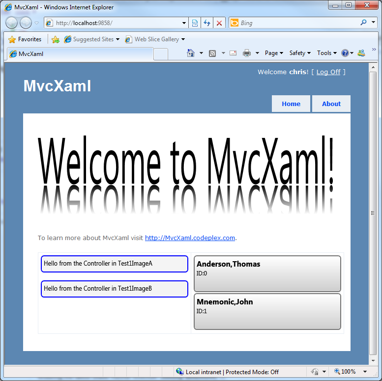

# MvcXaml

A custom View Engine for ASP.NET MVC that allows Controller Action Methods to return dynamically generated images based on XAML markup.

**FYI, this project was migrated here from Codeplex before it shutdown.**

## Articles

[MvcXaml - Images from XAML within ASP.NET MVC Application](http://pietschsoft.com/post/2011/01/09/MvcXaml-Images-from-XAML-within-ASPNET-MVC-Application.aspx) by Chris Pietschmann

[MvcXaml v1.0 is Available as a NuGet Package](http://nuget.org/packages/MvcXaml)

